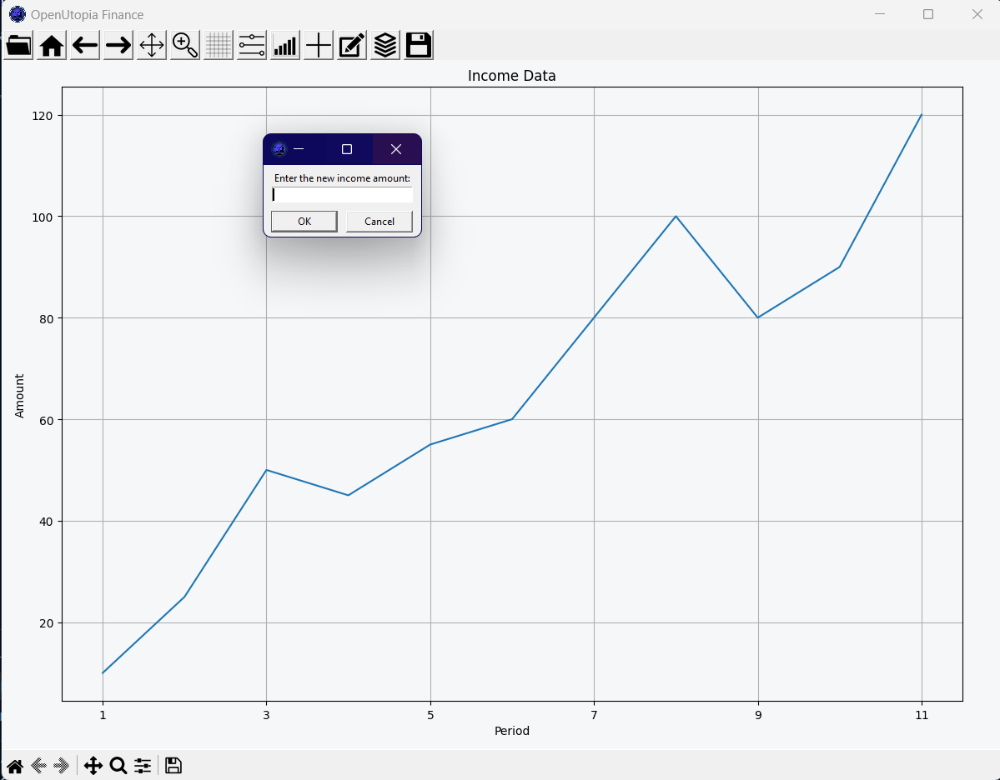
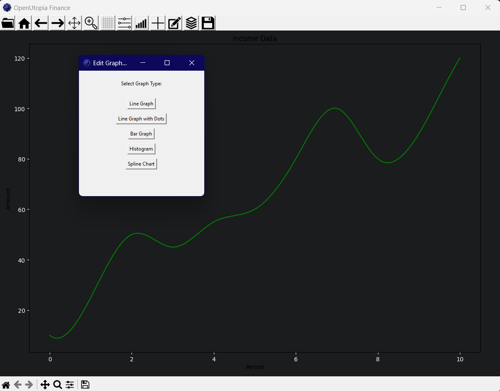

# OpenUtopia Finance

## Description
OpenUtopia Finance is a comprehensive financial management application designed to help users visualize and analyze their income data through various graph types. The app provides an intuitive interface that empowers users to make informed financial decisions with ease. Features include the ability to create, load, and customize graphs, as well as user-friendly navigation options.

* Add Data to your graph

## Features
- **Interactive UI:** Easy-to-use interface for creating new graphs or loading existing ones.
- **Multiple Graph Types:** Visualize income data with line, bar, histogram, and spline charts.
- **Real-Time Resizing:** Adjust graph dimensions in real-time with automatic saving.
- **Multiple Themes:** Visualize your graph with default, dark, blue or grey theme.
- **Shortcuts:** Easy-to-use Shortcuts that are also customizable.
- **Zoom:** Zoom in on different parts of your graph.

## Graph Types Supported
Line Graph: Displays income data over periods with or without markers.
Bar Graph: Visual representation of income data as bars.
Histogram: Displays frequency distribution of income data.
Spline Chart: A smoothed line graph for better visual appeal.

## Issues
If you encounter any issues or have suggestions for improvements, please open an issue in the repository.
